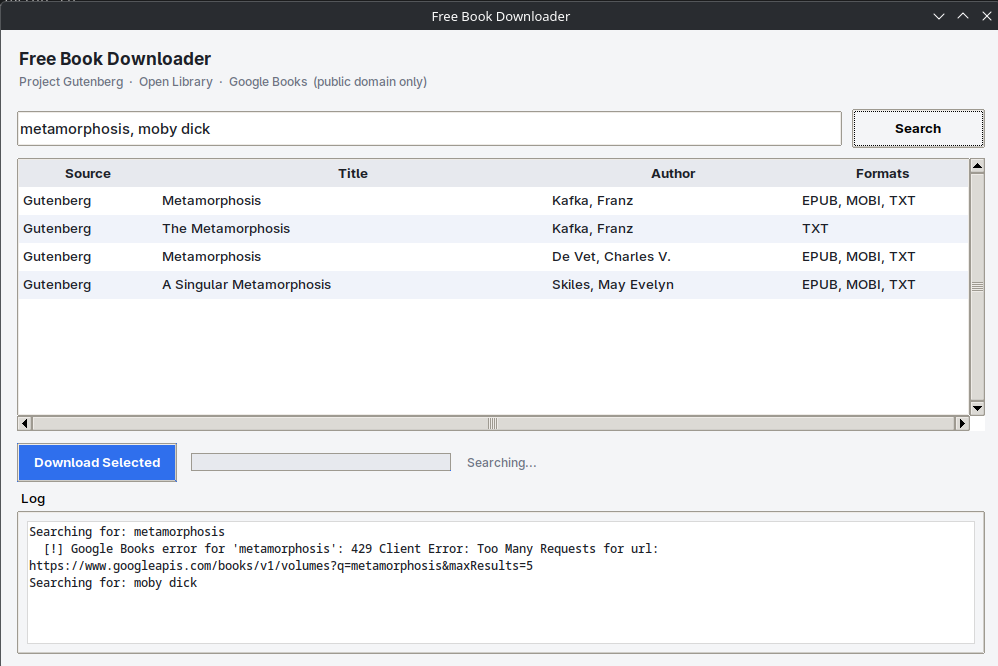

 Free Book Downloader

A desktop GUI for finding and downloading books that are genuinely free
and public domain, pulled from three sources:

- **Project Gutenberg** — full catalogue of public-domain texts.
- **Open Library / Internet Archive** — only items that are fully open
  access. Borrow-only (DRM-restricted) items are detected and skipped
  automatically; this tool never attempts to bypass lending restrictions.
- **Google Books** — only items Google's own API flags as public domain
  *and* provides a direct download link for. Most Google Books results
  are preview-only and won't appear here — that's expected.

Shadow libraries (Anna's Archive, Z-Library, LibGen, etc.) are not
supported and never will be, since they distribute copyrighted material
without a licence.

## Download

Grab the latest Windows executable from the
[Releases page](../../releases/latest) — no Python required.

## Screenshot


```markdown

```

## Running from source

Requires Python 3.9+.

```bash
pip install -r requirements.txt
python3 book_downloader_gui.py
```

On some Linux distributions, `tkinter` isn't installed by default:

```bash
# Debian/Ubuntu
sudo apt install python3-tk

# Fedora
sudo dnf install python3-tkinter

# Arch/Manjaro
sudo pacman -S tk
```

## Usage

1. Type one or more book titles into the search box, comma-separated.
2. Click **Search**. Results from all three sources appear in the table.
3. Select the rows you want (click-drag or Ctrl/Shift-click for multiple).
4. Click **Download Selected**. Files are saved into the `downloads/`
   folder, preferring EPUB > PDF > TXT > MOBI when more than one format
   is available.

## Building the .exe yourself

```bash
pip install pyinstaller
pyinstaller --onefile --windowed --name BookDownloader book_downloader_gui.py
```

The executable will be in `dist/BookDownloader.exe`.

## License

MIT — see [LICENSE](LICENSE).
